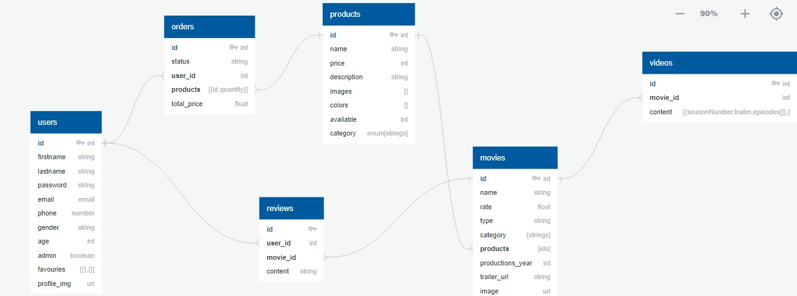

<!-- PROJECT LOGO -->
<br />
<div align="center">
  <a href="/Documentation.pdf">
    
  </a>


  <p align="center">
    An awesome README template to jumpstart your projects!
    <br />
    <a href="/Documentation.pdf"><strong>Explore the docs »</strong></a>
    <br />
    <br />
    <a href="https://alex-flex-frontend.vercel.app/">View Demo</a>
  </p>
</div>

<!-- TABLE OF CONTENTS -->
<details>
  <summary>Table of Contents</summary>
  <ol>
    <li>
      <a href="#about-the-project">About The Project</a>
      <ul>
        <li><a href="#built-with">Built With</a></li>
      </ul>
    </li>
    <li>
      <a href="#getting-started">Getting Started</a>
      <ul>
        <li><a href="#prerequisites">Prerequisites</a></li>
        <li><a href="#installation">Installation</a></li>
      </ul>
    </li>
    <li><a href="#usage">Usage</a></li>
    <li><a href="#development-process">Development Process</a></li>
    <li><a href="#contact">Contact</a></li>
  </ol>
</details>

<!-- ABOUT THE PROJECT -->

## About The Project


Developed an innovative movie streaming web application offers an immersive entertainment
experience combined with a seamless e-commerce platform, allowing users to explore and enjoy
a vast collection of movies while also having access to products associated with their favorite films.

### Built With

List of all frameworks/libraries used to bootstrap the App.

- [![Bootstrap][Bootstrap.com]][Bootstrap-url]
- [![React][React.js]][React-url]
- [![Node.js][Node.com]](Node-url)
- [![Express.js][Express.com]](Express-url)

## Getting Started

To get a local copy up and running follow these simple example steps.

### Prerequisites

- [Node](https://nodejs.org/en)
- [MongoDB](https://www.mongodb.com/)

### Installation

1. Clone the repo

   ```sh
   git clone https://github.com/SamyIsaac1/Alexflix-Web-App
   ```


2. cd ./ then Add .env file
   ```js
   URL = "mongodb://127.0.0.1:27017/Alexflix";
   Atlas_URL = "";
   BUFFER = 8;
   KEY = "confirmation";
   SENDER_EMAIL = ""; // Email to send confirm password...
   SENDER_PASSWORD = "";
   Url_FrontEnd = "http://localhost:3000";
   ```
3. open cmd ./
  ```sh
   npm install
   npm start
   ```

4. cd ./frontend then Add .env file
   ```js
   REACT_APP_BASE_URL = "http://localhost:8080";
   REACT_APP_Dark = "/movies/6480d1f16dac30a126565b6b";
   ```

5. open cmd ./frontend
   ```sh
   npm install
   npm start
   ```


List of 3rd Parties.

```sh
  // backend
  express
  express-validator
  mongoose
  multer
  cloudinary
  nodemailer
  cors
  jsonwebtoken
  bcrypt
  dotenv

  // frontend
  react
  react-bootstrap
  react-cgartjs-2
  react-dom
  react-router-dom
  axios
  bootstrap
  formik
  yup
  sweetalert2
```

## Usage
Once the server is running, you can access Task App by opening your web browser and navigating to http://localhost:8080

- you have to Sign in first.


- Login 


- Home page where you can add, delete, update your Tasks.


- Watch your favorite movie, series, and anime.


- Shopping you favorite movie's product usinh our store.


- Make an Order.


- Admin DashBoard.


<!-- ROADMAP -->
## Development Process


**Project Setup**: Started by setting up my development environment. Installed the necessary tools and frameworks such as Node.js, mongodb , and any additional libraries or dependencies required for my web app.

**Planning and Requirements Gathering**: Clearly defined the purpose, goals, and target audience of our web app. created a comprehensive plan.


**Backend-first Approach**:
Backend-first Approach because In this approach we can focus on developing and implementing the server-side logic, APIs, and database structure before working on the user interface and frontend components. This approach allows for the backend functionality to be thoroughly tested and validated before integrating it with the frontend.

**Backend Development Process**: 
- Setup nest app 
- Connect to mongodb 
- Create schema and models
  
- Implement CRUD operations for user, reviews, movies, orders, and products.
- Add Authenications using jwt
- Add Validations using express-validator
- Handle Not Found Route
- Handle Errors and Exceptions 


**Frontend Development Process**:
- Start search to find an inspiring design.
- Implement using html and css and bootstrap
- convert it to react components
 
- Add Login , Register pages
- Admin has a Dashboard for
  - Add, Delete, update user, products,movies,orders, and products  

- User
  - Watch movie, series, and Anime.
  - Add favorites
  - Write, update, delete review
  - Shopping from our store for products related to movies, series, and anime.
  - purchase products, make an order 
  - watch orders status  
- Add Not Found Page
- Handle Errors and Exceptions

## Contact

### Team members

Samy Isaac - samyIsaack7@gmail.com - [LinkendIn](https://www.linkedin.com/in/samy-isaac/) 

Mohaned Mohamed - mohanedmohamed41@gmail.com - [LinkendIn](https://www.linkedin.com/in/mohaned-mohamed-khalil/)

Adel George - adel.george.isaac@gmail.com - [LinkendIn](https://www.linkedin.com/in/adel-george/) 

Mohamed Halawa - mohamedhalawah22@gmail.com - [LinkendIn](https://www.linkedin.com/in/mohamed-halawa-b99334237/) 

Abdelrahman Salah - abdelrahmansalah141298@gmail.com - [LinkendIn](https://www.linkedin.com/in/abdelrahman-salah-85a823214/) 

Project Link: https://github.com/SamyIsaac1/Alexflix-Web-App

<!-- MARKDOWN LINKS & IMAGES -->

[React.js]: https://img.shields.io/badge/React-20232A?style=for-the-badge&logo=react&logoColor=61DAFB
[React-url]: https://reactjs.org/
[Bootstrap.com]: https://img.shields.io/badge/Bootstrap-563D7C?style=for-the-badge&logo=bootstrap&logoColor=white
[Bootstrap-url]: https://getbootstrap.com
[Node.com]: https://img.shields.io/badge/Node.js-18.x-green?style=for-the-badge&logo=node.js&logoColor=white
[Node-url]: https://nodejs.org/
[Express.com]:https://img.shields.io/badge/Express.js-4.x-blue?style=for-the-badge&logo=express&logoColor=white
[Express-url]:https://expressjs.com/

